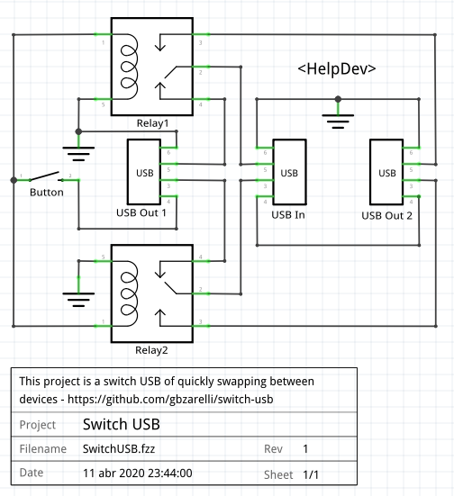

# [ELETRONIC] Switch USB

This project is easy switch USB created with the inspiration of swapping the wireless keyboard/mouse ou any other device USB quickly between two notebooks. The swapping will be performed at the push of a button.

[V1] Fallow the first version schematics:

